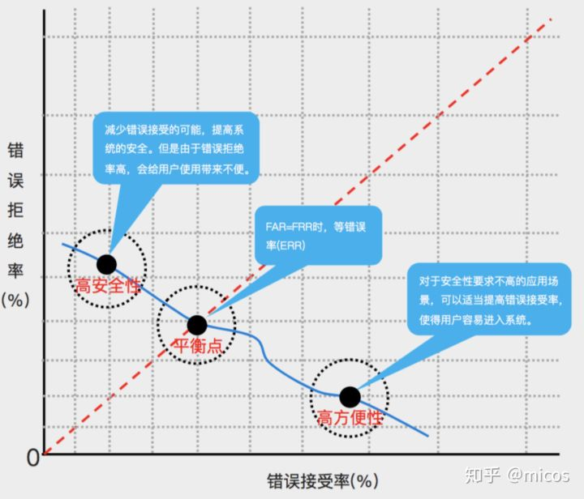

>分类器的评价指标主要作用是根据应用场景的不同，来评价不同的分类器性能。比如，癌症诊断中，宁可错判一个未患病患者，也不能遗漏一个真实癌症患者；食品检测中却不同，对于不合格的食品，尽可能的一个不漏。而对于一般的图像分类，就需要总和考虑，哪一方面判断错了都是不好的。

分类矩阵：

分类目标只有两类，计为正例（positive）和负（negtive）：
* True positives(TP): 被正确地划分为正例的个数，即实际 为正例且被分类器划分为正例的实例数（样本数）；
* False positives(FP): 被错误地划分为正例的个数，即实际为负例但被分类器划分为正例的实例数；
* False negatives(FN):被错误地划分为负例的个数，即实际为正例但被分类器划分为负例的实例数；
* True negatives(TN): 被正确地划分为负例的个数，即实际为负例且被分类器划分为负例的实例数。

----------

1. 准确率Accuracy、错误率Error rate
准确率：分类正确/总数=（TP+TN）/ Total
错误率：分类错误的比例=1-Accuracy

2. 精准率Precision、召回率recall、F指标F-Measure
* 精准率：Precision=TP /（TP+FP）
又称查准率，即对于我们的分类，有多少正品是被真正分类的。例子：食品检测中，我们的关注点其实在于不合格食品，因此，我们很在乎，被判别合格的食品中是否存在不合格食品，如果精准率太低是非常危险的，关系到人民的生命。

* 召回率：Recall=TP/(TP+FN)=TP/P
又称查全率，这个意思更好懂一点，即宁可错查一个错例，不能放过一个正例。
例子：医院癌症识别，我们希望尽可能的把所有的患者都能诊断出来，即便存在把实际未患病的也识别为患者的情况。

* F指标:
为了总和考虑精准率和召回率，使用的F指标

B是关与召回的权重，大于1说明更看重召回的影响，小于1则更看重精度，等于1相当于两者的调和平均。
F1指标（F1-Measure）：

3. ROC曲线（Receiver Operating Characteristic，ROC）、AUC（Area Under Curve）、EER（Equal Error Rate）

* ROC曲线：
横坐标：将正例分对 
True Positive Rate ( TPR ) = TP / [ TP + FN]
等同于召回率，即尽可能正确识别，因为错误识别代价太大，如癌症，这里表示安全性。
纵坐标：将错例分错
越高代表我们允许将错例分错，包容性更强。比如垃圾邮件过滤，我们允许部分垃圾邮件错误识别，从而防止可能存在重要文件被判别为垃圾邮件，导致损失，这样影响用户体验。
False Positive Rate( FPR ) = FP / [ FP + TN]

如下图所示：

* AUC
围住的面积，越大，分类器效果越好。即在保持分队的情况下，分错的概率最低。

* EER
即安全性和方便性达到均衡

参考：
https://zhuanlan.zhihu.com/p/33273532
https://www.zhihu.com/question/37436914